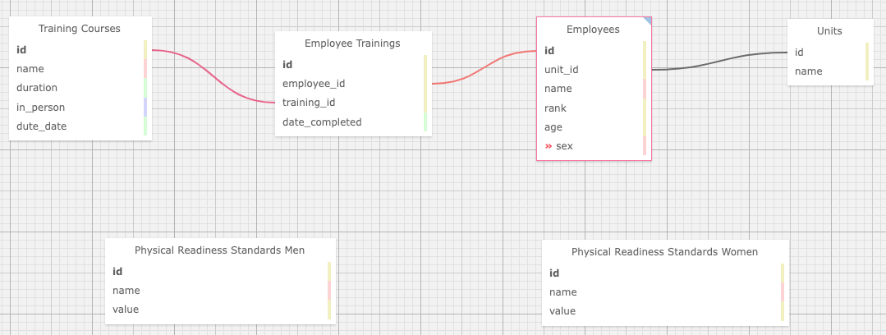

# Readiness Tracker

## Team Galvanized Guardians Roster Fix

## Setup

1. Clone down this project
    - Click on the code button at the top copy the link provided
    - Run
    ```bash
    git clone https://github.com/Chaos66-dev/sdi29-project3.git
    ```
2. Navigate to the repo directory and install dependencies
    ```bash
    cd sdi29-project3
    npm install
    ```
3. Create/Configure your database connection
    - In this roject, we configure a Postgres Container with our connection information defined in a .env file that sits in the 'sdi29-project3' directory. If you would like to use your own database, you are welcome to by changing the docker-compose.yaml file, as well as ensuring that the knex connections are configured as needed. Otherwise, create a '.env' file and include the following environment variables such that knex can connect to your database:
    ```bash
        POSTGRES_USER=<your-user-here>
        POSTGRES_PASSWORD=<your-password-here>
        POSTGRES_DB=<your-database-here>
        POSTGRES_HOST=db
        POSTGRES_PORT=5432
    ```
4. Build and start your containers
    ```bash
    docker-compose up --build
    ```
5. In a browser navigate to
    ```
    localhost:1000
    ```

At this URL you will find the front end client of the application. You can also inspect the server's api endpoints at localhost:4000 if desired.

You should now have a full stack application, populated with some initial dummy-data that will provide you with a look at what the site can do.

When finished with the app/server
- Hit `ctrl-c` to shut down the server
- Run
```
docker-compose down --rmi all
```

## Site Functionality

The Readiness Tracker keeps track of multiple units and the peronnel in those units tracking trainings due and readiness status.

On first load you will be greeted by:

<homescreen image>

Where you will sign in based on your personnel ID.

This ID code will set your information in the database for the initial run with no additional data added this will have to be a number between 1 and 3.

When signed in with a valid ID you can then navigate to the personnel, units or training button to view the information about the ID you have entered.

### Home

When clicked will take you back to the main page allowing you to either sign in to a new id or sign out

### Personnel

If logged in with a valid ID will present you all the peronal information associated with the ID you logged in with

### Units

If logged in with a valid ID will present you all the unit information associated with the ID you logged in with

### Training

If logged in with a valid ID will present you all the training information associated with the ID you logged in with

### Create

Takes you to a list of input fields that will allow a user to add in new informatiom into the database.

There are tabs under the navigation buttons that will set you to the type of information you are trying to create:

- Unit
- Personnel
- Trainings

### Database Description

For this project, we made use of a Postgres database with 6 tables representing information relating to personnel within the DoD. Our ERD was based off the image below and if you choose to use a database other than Postgres to run this application, ensure the relations between the tables and data are perserved:


## Testing
Logging into user 5 will set your account to our admin user that will be able to see all information availiable to the site

Running the tests that are included works as follows:

1. Compose the docker image with (if your containers are already running, skip this step)
```bash
docker-compose up --build
```
2. Testing the server
    - In a seperate console with the containers running
```bash
docker exec -it project-3-server
```
The above command will give you an interactive terminal connected to the container running our backend server that was created by running the `docker-compose up --build` command. Once connected to this container, run the following command to execute the backend tests.
```bash
npm test
```
The backend testing was implemented making use of Supertest, Mocha, and Chai to do both unit and integration testing of all the endpoints provided and ensuring that CRUD functionality is working as intended.
3. Testing the ui
    - In a seperate console with the containers running
```
docker exec -it project-3-ui
```
The above command will log you into the docker ui container that is running from the docker-compose
```
npm test
```